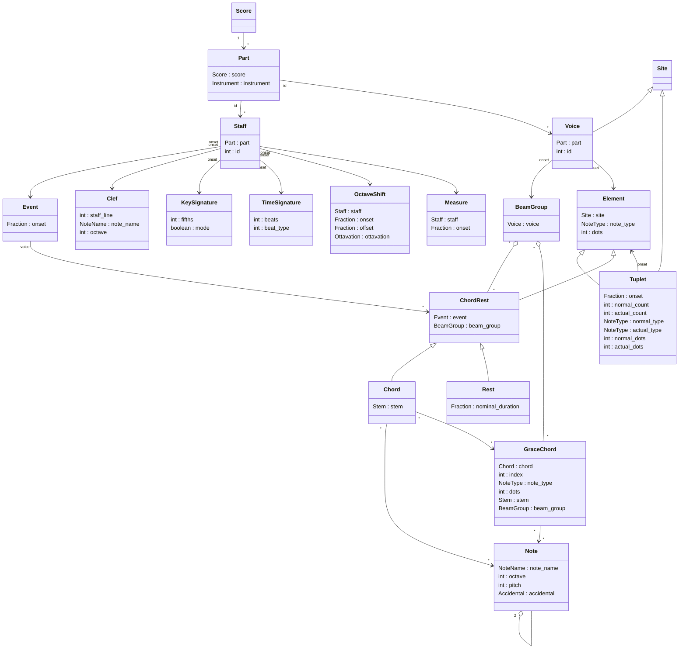

## MusicModel




Installation
=======================

To use this package in your project, clone the repository, navigate into its root directory and install the package into your Python environment:
```bash
cd MusicModelPython
pip install .
```
After that, all classes will be accessible within the `music_model` package namespace.