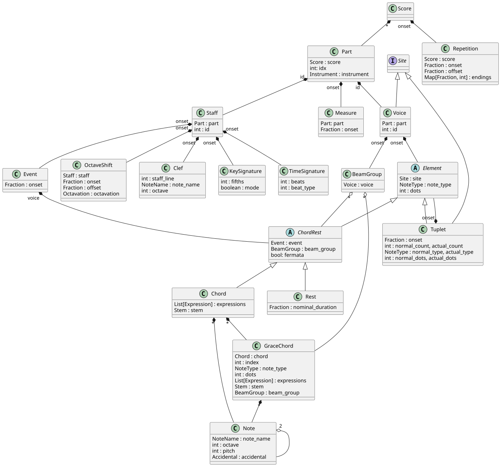

## MusicModel

A model capable of describing general Common Western Music Notation (CWMN) as well as tools to import/export from MusicXML and to visualize using MuseScore.




Installation
=======================

To use this package in your project, clone the repository, navigate into its root directory and install the package into your Python environment:
```bash
cd MusicModelPython
pip install .
```
After that, all classes will be accessible within the `music_model` package namespace.

Example Usage
=======================

```python
from music_model.conversion import *    # import import/export tools
from music_model import *               # import all classes of the data model

# instantiate model by loading a MusicXML file:
score = import_xml("example_file.musicxml")

# visualize (uses xml conversion and MuseScore internally):
show(score)

# export a model to musicXML:
write_xml_file(score, "xxx.musicxml")
```